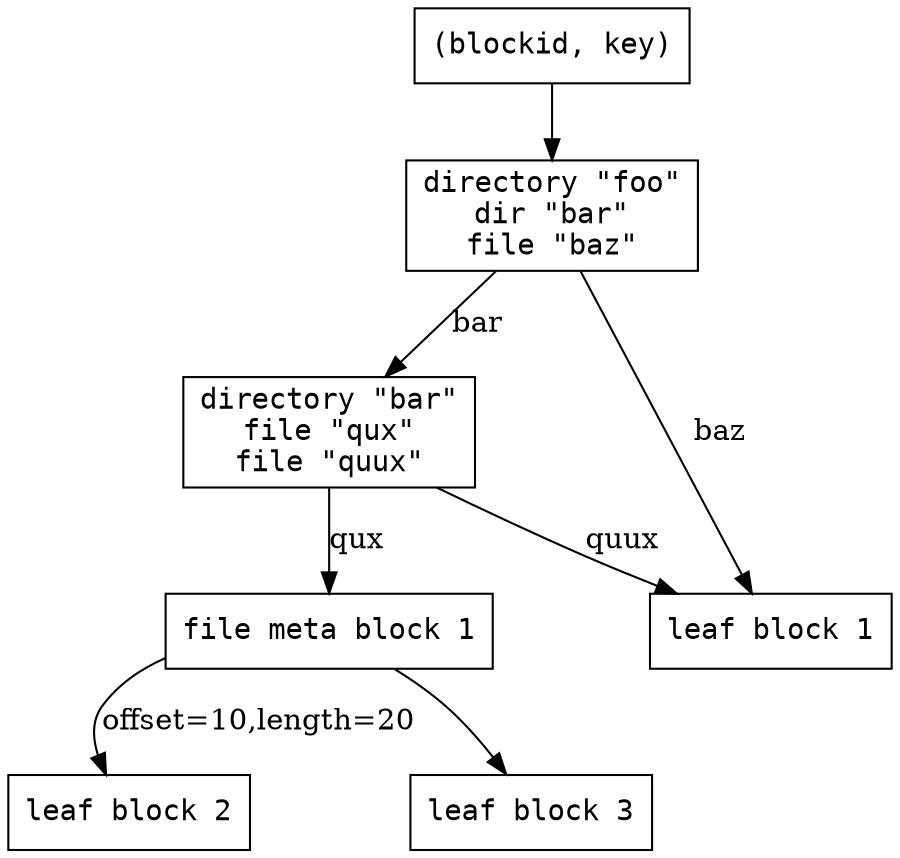

PROTOKOLL v2
===

[TOC]

* frontend
    + actual files / file tree
    + abstract, e.g.
        - FUSE (Filesystem in Userspace)
        - plain files
        - webdav / http api
        - samba/nfs
        - …
    + render the current tree state
    + propagate changes back, translating them into blockdb changes
* blockdb
    + independent storage of raw blocks
    + used to construct actual file-tree (frontend)
    + modified Merkle-Tree
    + abstract backend, e.g.
        - plain files
        - sqlite
        - …
    + invariants:
        - block identified by blockid, aka hash(block), thus is CoW
        - hash algorithm configurable but not compatible - if you wanna change it, you have to convert your entire db on every participant
        - variable block size, by default each file is one block and each dir is one block
        - blocks can be arbitrarily large
        - can store partial blocks! (e.g. incomplete/aborted transfers)
    + MAY use compression! lots of low hanging fruit here in terms of space savings!
    + different types of blocks:
        - leaf blocks
            * actual file contents
            * contain arbitrary payload data
        - file meta blocks
            * a list of blockrefs
            * the file is a concatenation of the blockref's payloads
            * cycles of file meta blocks not easily possible due to merkle tree structure
        - directory blocks
            * files / folders and one blockref each
            * metadata: Name, lastmodified, size
    + blockref = (blockid, key, hints)
        - NB changing the key of a blockref changes the plaintext
        - however modifications of the key (and the ciphertext if the cipher is CCA secure) produce random changes in plaintext
        - hints = Vec<(blockref, offset, length)>
            * "this block consists of these parts of other blocks"
            * prevent redownload of known subblocks
            * important when subdividing file blocks (e.g. change this part here in the middle: separate into 3 leaf blocks: first hints at beginning of original block, last at end, middle is new -> no redownload of first and last leaf block)
            * optional (can be empty or ignored), but can be used for optimizations
            * if set, it MUST be correct
            * correctness MUST be verified by blockid
            * MAY be used
            * SHOULD be forwarded
            * MAY be implemented for file meta blocks (2 PB file which gets changed often) and directory blocks (directory with 1e6 files)
            * SHOULD be implemented for leaf blocks
* random thought: zfs module possible; control front- and backend; use snapshots as blockdb

#### Example Merkle Tree (simplified)



### bootstrap

folder always starts out empty; empty block hash is known, thus no bootstrap is required - everyone spontaneously starts out in the same state

### basic protocol

```sequence
participant Alice as A
participant Bob as B
Note over A: frontend detects changes
Note over A: update blockdb: new blocks, new root
A->B: Root Update from 13fd to 53d3
Note over B: 53d3 is unknown
B->A: Block Request: 53d3
A->B: Block Request Response:\ntransfer ids 0-2 allocated for 53d3
B-->A: status update: missing 0-2
A->B: transfer payload #0
A->B: transfer payload #1
Note left of B: send status updates as necessary
A->B: transfer payload #2
B-->A: status update: none missing
Note over B: 53d3 has arrived
Note over B: 53d3 references known e3b0
Note over B: 53d3 references unknown 934c, a209
B->A: Block Request: 934c
B->A: Block Request: a209
A->B: Block Request Response:\ntransfer ids 3-17 allocated for 934c
A->B: Block Request Response:\ntransfer ids 18-42 allocated for a209
Note over A,B: transfer commences . . .
Note right of B: Traverse tree,\nrequest blocks\nas needed
Note over B: everything consistent? update root!
Note over B: frontend applies the update
B->A: Root Update Response: from 13fd to 53d3
```

### conflict resolution

* block db: there are no conflicts
* root updates: longest chain wins, numerically lower hash to break ties
    + Simplification for implementation (server-client): Just use an RwLock on server, first come first serve
* bulk work done in the frontend
    + frontend has to aggregate its changes into "transactions" that atomically update the entire tree up to the root
    + frontend has to sort out "transaction aborts", aka you made a new root but it was rejected
    + we basically have a 3way diff at this point
    + can auto-merge on directory level: simply take the most recent version of each file
    + can't auto-merge files -> link both versions into the directory tree, just like dropbox
    
### control protocol

* similar to simple TCP
    + Not often, not too relevant
    + open transfers can still produce enough traffic to fill pipe
    + TODO

### transfer protocol

basically PROTOKOLL v1 with a few changes:

* bidirectional (one channel instance in each direction)
* instead of one transfer we have
    + multiple
    + fixed-size
    + dynamically allocated
    + transfers
* global, incrementing ids
* to deal with unknown number of chunks, ids are varints
    + Variable receive windows, must be large enough to hold largest variant + largest possible control payload
* channel starts out idle
* receiver requests a block
* sender allocates a range of chunk ids for the block transfer
* keep sending until we sent it all, then connection is idle again
* naturally, any status report causes us to jump back and un-idle
* Control Payload
    + can open new transfers
* Data Payload
    + within a transfer

TODO: finish graph

```flow
st=>start: Start
e=>end: End
handshake=>operation: Handshake
checkstatus=>operation: Check transfer cursor
statuswait=>operation: Wait for status update
send=>operation: Send chunk

workcond=>condition: Cursor at end?

st->handshake->checkstatus->workcond
workcond(no, bottom)->send(left)->checkstatus
workcond(yes)->statuswait(right)->checkstatus
```

### connection management

* connection setup: simple handshake (TODO: really needed anymore?)
* connection teardown can happen at any time, just a handshake of fin packets

### packet format

General:

```
flags {
    fin: bool,
    transfer payload: bool,
    transfer status: bool,
    
},
data
```

(compare exchange)


Root Update:

* AEAD

```
from blockid: [u8; N], // fixed length
to blockid: [u8; N], // fixed length
nonce: [u8; L], // fixed length
TODO
```

Root Update Response:

```
from blockid: [u8; N], // fixed length
to blockid: [u8; N], // fixed length
Ok / Nope
```

Block Request:

```
blockid: [u8; N] // fixed length
```

Block Request Response:

```
blockid: [u8; N] // fixed length
ids A to B reserved
```

Blocks:

TODO

### crypto

* design goal: sophisticated/fancy crypto in later versions only
    + including fine grained multi user permissions

#### Filesystem Crypto

* v1: 1 folder/root = 1 user = 1 symmetric key, end of the story
* blockdb implicitly authenticated by blockid (Encrypt-then-MAC)

#### Transmission Crypto

* No Handshake
* blocks already encrypted
* control protocol mostly unencrypted
* Only Root Update encrypted, because it contains the key
    + AEAD
    + GCM with random nonce
    + nonce sent in same packet
* knowing a blockid entitles you to its contents
    + Guessing blockids not a problem, because attacker can't decrypt
* to support subslicing, each block is encrypted with a self-synchronizing stream cipher
* key of block = hash(plaintext) (possible attacks?)
    + same file will result in same blockref (with a random key it won't)
    + no duplicated data even if file exists multiple times

#### Threat Model (v1)

* attacker is not the user, i.e. does not know the secret master key
* attacker can eavesdrop on all network communications (Eve)
* attacker can send/modify network traffic arbitrarily (Mallory)
* confidentiality: encryption
    + block contents are encrypted (provably secure, todo verify)
    + transfers are transferring encrypted data
    + side channel: block lengths
    + side channel: block update frequency (roots/directory blocks trivially distinguishable)
    + root updates are AEAD'd under the master key
* authentication
    + block contents unforgeable, have to match the hash
    + merkle tree property: having a legit root confirms everything below
    + root updates being aead ensures roots are legit
    + real danger here: leaf block contents are completely arbitrary, you can serialize a root in there if you find a way to control the root ptr
* denial of service
    + trivial; withhold all traffic
    + defending against attacker that can spoof/inject but not drop: future work, right now trivial by just sending FINs
* resource exhaustion
    + synflood -> TODO need smth like syncookies to mitigate
* Replay
    + irrelevant, known blocks discarded
    + can only result in DoS, which is possible anyway
    + TODO
* Spoofed attacker
    + probably irrelevant, same as replay
    + TODO
* Can we be used as DoS amplifier?
    + TODO
* ddos
    + transfers bound to handshake
* 1 user means "inside job" attacks (access someone else's private folder, resource exhaustion attacks after auth, etc) don't apply
* instead, each user has its own seperate storage (block db) on the server